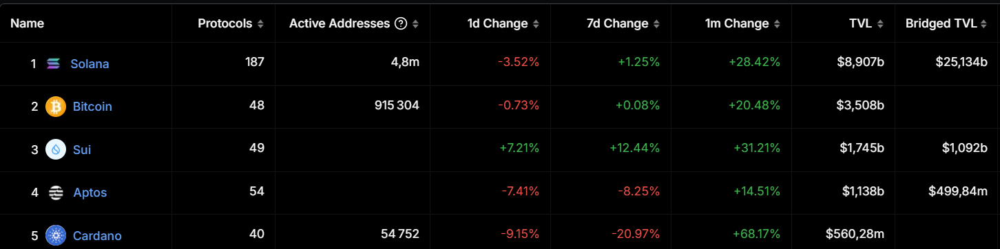

## Introduction

The language of money or `Move` is a programming language that was first created by Meta for their Diem blockchain project. Even though Diem didn't continue, Move has become popular and is now used by big blockchains like Sui and Aptos. These blockchains like Move because it helps manage digital assets safely and flexibly.

As we get closer to 2025, the blockchain world is changing fast, and Move is leading the way. Learning Move this year can help you take advantage of new opportunities and be part of the exciting changes in blockchain technology. Adding to that, new blockchains like Movement Labs will make Move even more important and useful.

## Unique Features of Move Language

### Resource-Oriented Programming

Move introduces a unique way of handling resources, ensuring that ownership, transfer, and scarcity are managed safely. This approach helps prevent unauthorized access and modifications, making it ideal for secure digital asset management.

### Security by Design

Move is built with security in mind. It includes safeguards against common vulnerabilities like reentrancy, making it a preferred choice for developing secure blockchain applications. The language's design ensures that smart contracts are robust and reliable.

### Modular Architecture

Move offers a flexible and modular architecture, allowing developers to create reusable and composable modules. This modularity enhances the ability to build complex applications efficiently and securely.

### First-Class Resources

Move's first-class resources are inspired by linear logic, providing inherent scarcity protections. Resources can only be moved, not copied or discarded, ensuring safety. Developers can define custom resource types, making Move adaptable to various blockchain needs.

### Safety and Verifiability

Move's executable format is bytecode, which is verified and executed directly, eliminating potential vulnerabilities from the compilation process. The language supports functional verification, allowing developers to ensure their programs meet specific safety properties.

## Comparison with Other Blockchain Languages

### Move vs Solidity

Move offers enhanced security and scalability compared to Solidity, which is widely used in EVM chains. While Solidity is popular, Move's resource-oriented programming provides stronger guarantees against common vulnerabilities, making it a safer choice for developers focused on security.

### Move vs Rust

Move simplifies some aspects of Rust while retaining its power for blockchain use. Rust is known for its performance and safety, but Move's design makes it easier to manage digital assets securely, offering a more streamlined experience for blockchain developers.

### Comparison with Popular Languages

In a crowded space of programming languages, Move sets itself apart. Its unique features and focus on security make it a compelling choice for blockchain development, despite some limitations. A detailed comparison with popular languages like Solidity and Rust highlights the advantages and potential drawbacks of using Move.

## Job Opportunities in Move vs Solidity

The blockchain industry is experiencing a growing demand for Move developers and auditors. While Solidity remains the dominant language for EVM chains, the large number of developers and auditors in this space has led to a saturated job market. Many professionals are competing for the same positions, making it challenging for newcomers to find opportunities.

Public contests for auditing Solidity projects often attract a large number of participants, highlighting the intense competition in this field. This saturation can make it difficult for individuals to stand out and secure positions.

In contrast, Move is emerging as a promising field with increasing job openings. The adoption of Move-based blockchains like Sui and Aptos is driving demand for skilled professionals. This creates exciting opportunities for developers and auditors to establish themselves in a less crowded market, where their expertise is highly valued.

Overall, the Move ecosystem presents a unique opportunity for professionals to grow their careers in a dynamic and evolving field, with less competition and more room for innovation.

## Increasing Adoption of Move

### Sui and Aptos Leading the Way

  
  Sui and Aptos are relatively new entrants in the blockchain space, yet they are quickly gaining traction. The image above highlights their impressive growth compared to more established platforms like Solana and Bitcoin.

- **Sui**: Known for its parallel execution capabilities, Sui is showing remarkable growth in atotal value locked (TVL). This indicates a strong adoption rate and increasing trust in its innovative features.

- **Aptos**: With its fast finality, Aptos ensures quick and reliable transaction confirmations. Despite being new, it is already competing with older blockchains, showcasing its potential to become a major player.

Both Sui and Aptos are benefiting from Move's robust architecture, allowing them to offer unique features that attract developers and users. Their rapid rise in the blockchain landscape underscores the effectiveness of their technology and the growing interest in Move-based platforms.

For more insights, you can explore the [resource](https://defillama.com/chains/Non-EVM) that provides detailed information on non-EVM blockchain platforms.

### Growing Ecosystem

The Move ecosystem is growing fast, with new projects, tools, and community support popping up all the time. While there aren't as many protocols as big players like Solana or EVM chains, Move's special features are attracting a creative and dedicated community. This makes it easier for developers to build and launch Move-based apps.

New Move-based blockchains are also emerging, including Layer 2 solutions in the EVM space `Movemant labs` with the new MovEvm. Additionally, some blockchains are exploring exciting new possibilities with AI and blockchain, taking Move to the next level and offering great opportunities for developers and users.

## Market Potential in 2025

### Rising Demand for Decentralized Applications (dApps)

The demand for scalable and secure dApps is on the rise. Move is well-suited to meet this need with its robust security features and efficient resource management. Developers are increasingly turning to Move to build applications that can handle large-scale operations without compromising on safety.

### Enterprise Use Cases

Enterprises are starting to explore Move for its strong safety guarantees and efficient handling of resources. Move's ability to manage digital assets securely makes it an attractive option for businesses looking to integrate blockchain technology into their operations.

### Funding Opportunities

There is growing interest from venture capitalists in Move-based projects. Funding trends indicate strong support for innovative solutions built on Move, providing developers with the resources they need to bring their ideas to life.

## Conclusion

Move is rapidly becoming a key player in the blockchain world, offering unique features and opportunities. With its growing ecosystem and demand for skilled professionals, Move presents an exciting path for developers and auditors. As the industry evolves, embracing Move could be a strategic move for those looking to innovate and excel in blockchain development.

