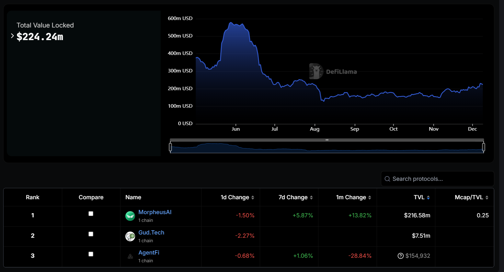

                                        [resouce](https://defillama.com/protocols/AI%20Agents)
## Ai Agent in Defi 

Artificial Intelligence and blockchain technology are coming together to revolutionize the space of DeFi. A promising innovation that comes from the intersection of AI and blockchain is AI agents: `self-sufficient` software systems able to perform complex tasks independently. In this blog post, we look at what AI agents are, how they have been applied in DeFi, and why they are a promising future for decentralized finance.

even if you are not a developer or a blockchain enthusiast, you still can learn a lot from this article. 

### Why the Hype ? 

AI agents have gained traction in the defi, driven by their ability to automate trading, manage portfolios, and mitigate risks. Recent advancements have made AI agents more dynamic and intelligent, outperforming traditional bots in the fast-paced DeFi space.

So, launchpad AI agents have done some amazing stuff, like launching memecoins, just kidding, that's not the actual use case. To be more serious, the hype really kicked off with meme coin launchpads, and honestly, it's still the biggest use case out there.

Even thought  Vitalik Buterin himself have discussed the intersection of [AI and DeFi](https://vitalik.eth.limo/general/2024/01/30/cryptoai.html), highlighting its potential to reshape the industry.

### What Are AI Agents?
AI agents are software entities that can perform autonomous operations following specific parameters and machine learning models. They have several key characteristics:

- Ability to reason, make decisions, and take actions based on information processing
- Short-term working memory for accomplishing specific tasks
- Long-term memory to learn from experiences and improve over time
- Self-sufficiency to operate independently, though still requiring human oversight for critical decisions

In the context of Blockchain and DeFi, AI agents are enabling more intelligent, automated interactions across decentralized ecosystems. They can analyze data, execute transactions, and provide personalized support to users - making blockchain technology more accessible and efficient.

### AI Agents vs. Bots in DeFi

1. Traditional Bots :
  - Rule-Based: Operate on predefined logic.
  - Static: Require manual updates to adapt.
  - Task-Oriented: Limited to repetitive operations.
  - Examples: Arbitrage bots, liquidation bots, Launchpad tokens ai agent. 

2. AI Agents  :
  - Adaptive: Learn and evolve using machine learning.
  - Dynamic: Respond to changing market conditions in real-time.
  - Intelligent: Analyze vast datasets and make informed decisions.
  - Examples: Predictive trading, yield optimization, risk mitigation.

3. Key Differentiators  ::
While bots follow static rules, AI agents adapt, learn, and optimize strategies autonomously, providing a significant edge in the complex DeFi landscape.

### AI Agents in DeFi
The integration of AI agents into DeFi platforms is transforming how we interact with decentralized finance. Some key applications include:

- Portfolio Management : 

AI agents can analyze market data and automatically rebalance portfolios for optimal returns.
They can identify diversification opportunities and suggest asset allocations.

- Trading Optimization :

Agents can analyze market trends and execute trades at optimal times.
They can implement complex trading strategies that would be difficult for humans to manage manually.

- Risk Management :

AI agents can continuously monitor DeFi protocols and alert users to potential risks.
They can automatically adjust positions to mitigate exposure to specific threats.

- Yield Farming Optimization :

Agents can analyze yield farming opportunities across different DeFi protocols.
They can dynamically allocate capital to maximize returns while managing risk.

- Governance Support :

AI agents can analyze proposals and provide data-driven insights to DAO members.
They can help summarize complex governance documents and estimate potential outcomes.

### How AI Agents Work in DeFi
- Data Collection :
AI agents gather data from blockchains, market trends, and user inputs.

- Analysis :
Advanced algorithms analyze patterns to identify opportunities and risks.

- Decision-Making :
AI agents formulate optimal strategies based on real-time insights.

- Execution :
They interact with smart contracts to perform tasks like rebalancing, trading, or yield farming.
- Continuous Learning :

Using feedback loops, AI agents refine their strategies over time.

### Conclusion
AI agents are changing DeFi by making it smarter, faster, and more efficient. They help users automate tasks, manage risks, and find the best opportunities with minimal effort.

As AI and DeFi grow together, they promise a future of simpler, more powerful, and accessible financial tools for everyone, even begginers.

wait part 2 for deep diving in the core of ai agent in defi 